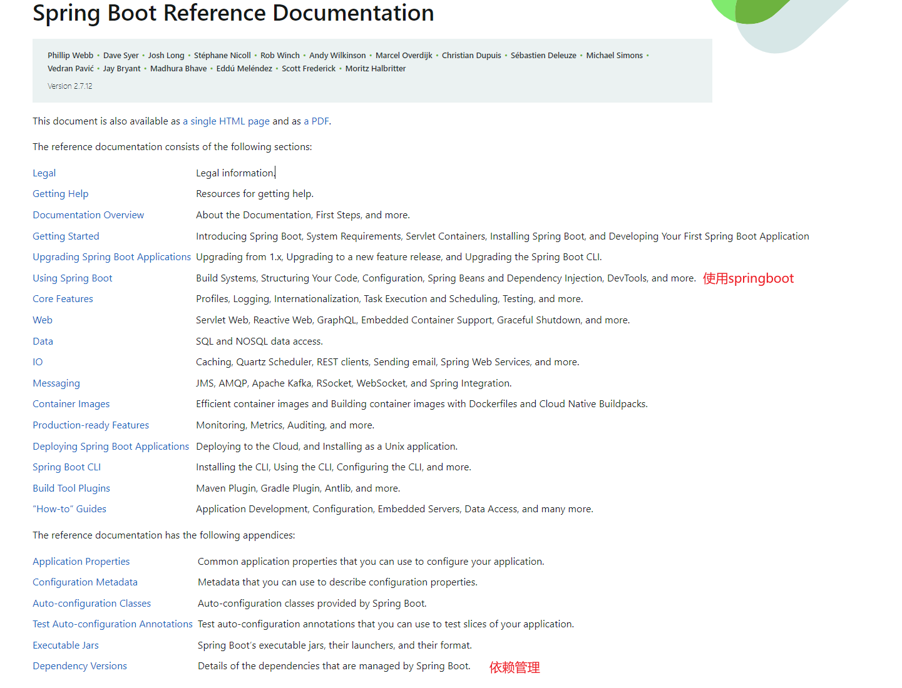
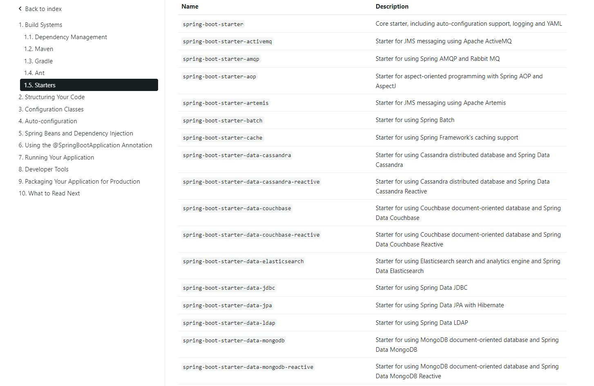
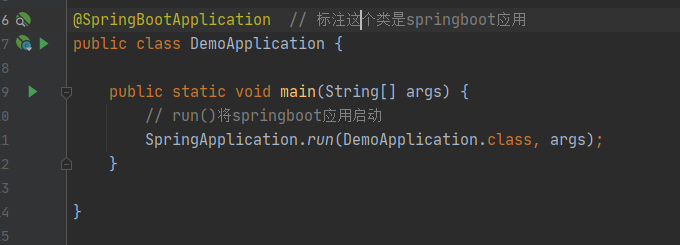
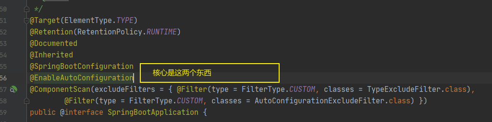
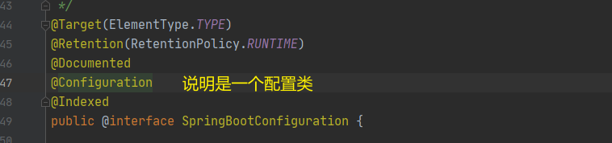
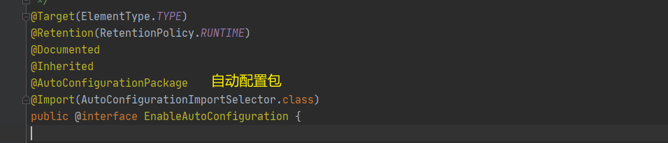
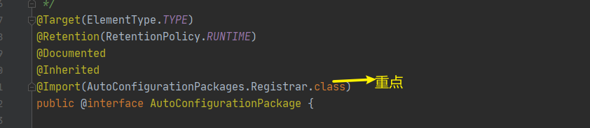
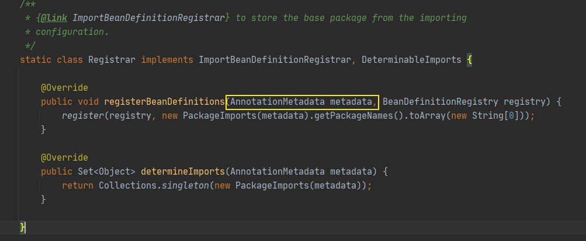
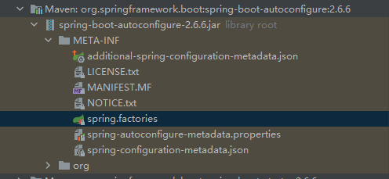

# 概述
基于spring initializer 创建的项目
创建后删除掉自带的.mvn文件和一些没用的脚本文件


```
<dependency>
    <groupId>org.springframework.boot</groupId>
    <artifactId>spring-boot-starter-web</artifactId>
</dependency>
```

这个依赖是web的依赖， 包含了springmvc, 包含了嵌入式的tomcat


spring 所有的依赖都是spring-boot-starter开头的


如果不要web,则引入依赖

```
        <dependency>
            <groupId>org.springframework.boot</groupId>
            <artifactId>spring-boot-starter</artifactId>
        </dependency>
```


# 自动配置原理

1. 看pom文件

2. 看spring-boot-starter-parent
3. 看spring-boot-dependencies
    1. jar包的版本都在这里管理了， 这样引入依赖时就不用指定版本
4. spring-boot-starter 启动器帮我自动导入配置， 这个其实可以自己写





有很多启动器可以选择




```java
@SpringBootApplication // 标注一个类是springboot应用，启动类下的所有资源被导入
	@SpringBootConfiguration
		@Configuration
			@Component
	@EnableAutoConfiguration  // 自动配置
		@AutoConfigurationPackage  // 自动配置包
			@Import(AutoConfigurationPackages.Registrar.class)  // 自动配置，包注册
		@Import(AutoConfigurationImportSelector.class) // 自动配置导入选择
			String[] selectImports(AnnotationMetadata annotationMetadata);
				getAutoConfigurationEntry(annotationMetadata);
					getCandidateConfigurations(annotationMetadata, attributes);
						SpringFactoriesLoader.loadFactoryNames(getSpringFactoriesLoaderFactoryClass(),
				                                               getBeanClassLoader());
							// 配置类在spring-boot-autoconfigure包下的 META-INF/spring.factories （自动配置的核心文件）
							getSpringFactoriesLoaderFactoryClass();
								// 上面出现过@EnableAutoConfiguration
								return EnableAutoConfiguration.class; 
                            getBeanClassLoader();
```









很重要的注解： @EnableAutoConfiguration




很重要的注解： @AutoConfigurationPackage







